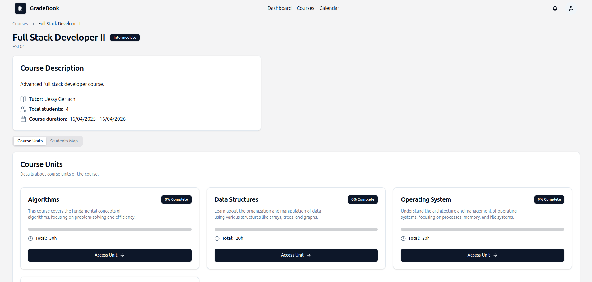
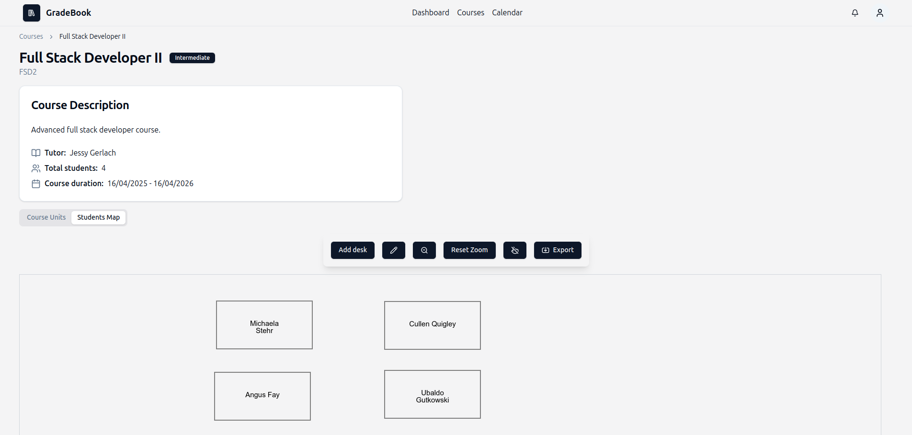
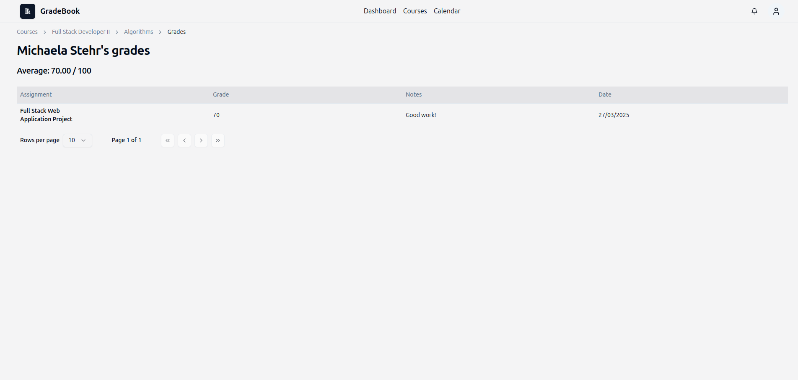
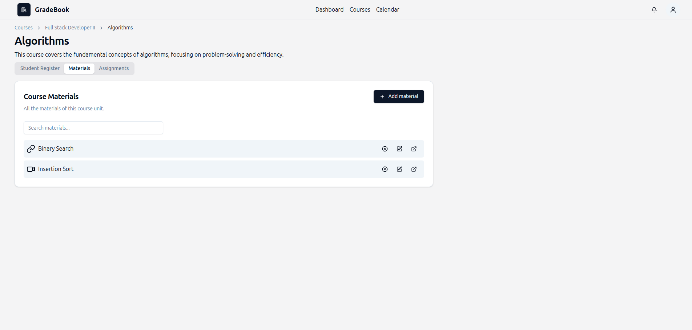
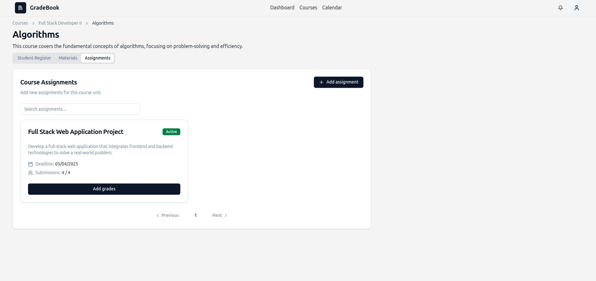
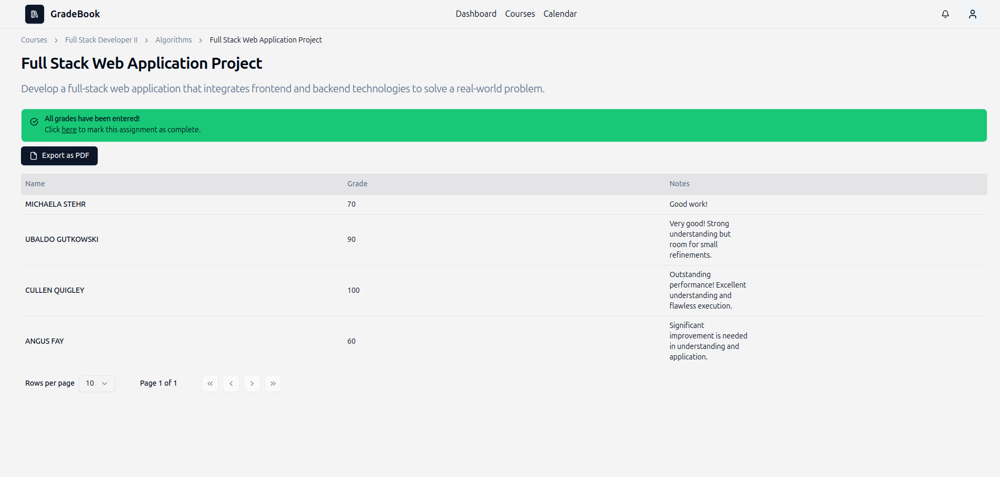
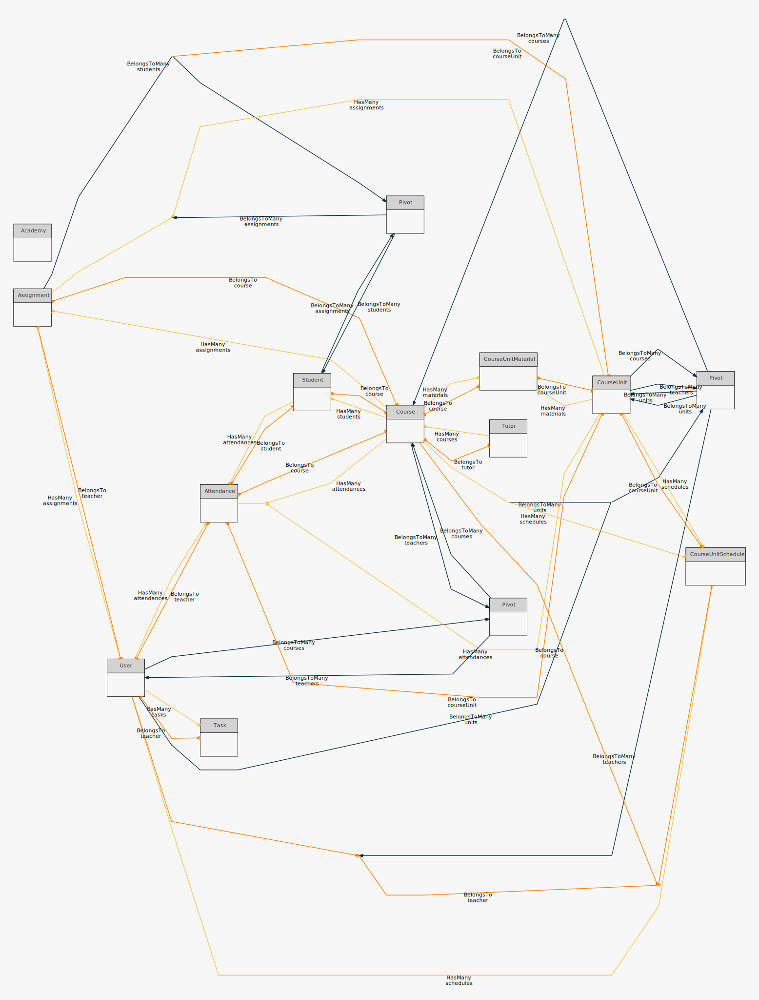

<h1 align="center">
  <br />
   
  <br />
   GradeBook
  <br />
</h1>

<h4 align="center">A digital school register designed to help teachers manage courses, schedules, student attendance, and educational materials.</h4>

---

## Features

### Login

- Teachers can log in securely to access their dashboard and courses.
- Ensures data privacy and security.


### Dashboard

- View total courses and students assigned to the logged-in teacher.
- Get insights into the next scheduled lesson.
- Receive real-time notifications.
- Manage tasks: create and delete tasks.
- View academy-related statistics, personalized for each teacher.


### Courses

- Displays courses where the logged-in teacher is assigned.
- Each course contains educational units, but only the ones where the teacher is involved are visible.
- Students map is available for each course.





Inside an educational unit:

- **Attendance tracking**: Register lesson start and end times, record early exits and late arrivals.
- **Grades**: View grades and average for each student.
- **Material management**: Upload and organize teaching materials (links, videos, PDFs).
- **Assignments**: Create and manage assignments. Assign grades and notes to each student. Export assignment details to PDF.







### Calendar

- Displays all scheduled lessons for the teacher.
- Clear and user-friendly calendar view for easy lesson tracking.


### Notifications

- Real-time notifications:

  - **10 minutes before** each scheduled lesson as a reminder.
  - **10 minutes after** each lesson officially ends, notifying the teacher if the lesson hasn't been marked as completed.

- Notifications are stored in the system for later reference.


### Profile

- View and update teacher information.
- Edit profile information.
- Upload a profile picture.


---

## Tech Stack

### Frontend

- [React](https://reactjs.org/) for building the user interface.
- [TypeScript](https://www.typescriptlang.org/) for type safety.
- [Tailwind CSS](https://tailwindcss.com/) for styling.
- [Shadcn/ui](https://ui.shadcn.com/) for UI components.

### Backend

- [PHP](https://www.php.net/) for server-side programming.
- [Laravel](https://laravel.com/) for building a robust and powerful web application.
- [Laravel Sanctum](https://laravel.com/docs/sanctum) for authentication.
- [Laravel Reverb](https://reverb.laravel.com/) for WebSocket communication.

### Database

- [PostgreSQL](https://www.postgresql.org/) for data management.

### Other Libraries

- [React Router](https://reactrouter.com/) for routing.
- [React Hook Form](https://react-hook-form.com/) for form handling.
- [Zod](https://zod.dev/) for schema validation.
- [Axios](https://axios-http.com/) for API requests.
- [date-fns](https://date-fns.org/) for date formatting.
- [Konva.js](https://konvajs.org/docs/react/index.html) for interactive 2D canvases.
  
---

## Getting Started

### Prerequisites

Ensure you have the following installed:

- [Git](https://git-scm.com/)
- [Node.js (20+)](https://nodejs.org/en/)
- [PHP, Composer and Laravel](https://laravel.com/docs/11.x#installing-php)
- [PostgreSQL](https://www.postgresql.org/)

### Installation

1. **Clone the repository**:

   ```bash
   git clone https://github.com/lucchesilorenzo/gradebook
   cd gradebook
   code .
   ```

2. **Install dependencies**:

   ```bash
   npm install && npm run install-all
   ```

3. **Configure frontend environment variables**:

   ```bash
   cd frontend
   ```

   Create a `.env` file at the root of the frontend project and copy what's in the `.env.example` file:

   ```bash
   VITE_APP_NAME="GradeBook"
   VITE_APP_DESCRIPTION="GradeBook is a streamlined software for managing courses, students, and academic records in a single tertiary education institution, offering an intuitive interface for teachers."
   VITE_BASE_URL="http://localhost:8000"

   VITE_REVERB_APP_KEY=a49a01c63ef82d93394eb993a55284dcaa37071daa436fa04107f37342873932
   VITE_REVERB_HOST="localhost"
   VITE_REVERB_PORT=8080
   VITE_REVERB_SCHEME=http
   ```

4. **Create a PostgreSQL database with the name "gradebook"**.

5. **Configure backend environment variables**:

   ```bash
   cd ../backend
   ```

   Create a `.env` file at the root of the backend project and copy what's in the `.env.example` file. Then, configure your database and Reverb settings:

   ```bash
   DB_CONNECTION=pgsql
   DB_HOST=127.0.0.1
   DB_PORT=5432
   DB_DATABASE=gradebook
   DB_USERNAME=your_username
   DB_PASSWORD=your_password

   BROADCAST_CONNECTION=reverb
   REVERB_APP_ID=89118a2cfcc1da97f83474f4346a02eb4b31169d39a1cfaf02b9e221b86de72a
   REVERB_APP_KEY=a49a01c63ef82d93394eb993a55284dcaa37071daa436fa04107f37342873932
   REVERB_APP_SECRET=ce8ed9ec630e15806a9801636f4a57b07451f2e7fa6a92389027ca9ba0c94a21
   REVERB_HOST="localhost"
   REVERB_PORT=8080
   REVERB_SCHEME=http
   ```

6. **Generate Laravel application key**:

   ```bash
   php artisan key:generate
   ```

7. **Run database migrations and seed data**:

   ```bash
   php artisan migrate --seed
   ```

8. **Run this command for processing jobs**:

   ```bash
   php artisan queue:work
   ```

9. **Run this command to execute scheduled tasks**:

   ```bash
   php artisan schedule:work
   ```

10. **Run this command to run Reverb server**:

    ```bash
    php artisan reverb:start
    ```

11. **Start both the frontend and backend**:

    ```bash
    cd .. && npm start
    ```

    The frontend will be running at [http://localhost:5173](http://localhost:5173).

---

## Database Schema

Here's a basic overview of the core models:



---

## API Documentation

The API documentation is available at [http://localhost:8000/api/docs](http://localhost:8000/api/docs).

---

## Installation with Docker

### Prerequisites

Ensure you have the following installed:

- [Docker](https://www.docker.com/get-started/)

1. **Copy the `.env.example` file to `.env` in both the frontend and backend directories.**
2. **Generate the Laravel application key by running:**

   ```bash
   php artisan key:generate
   ```

3. **Update the database host in the backend `.env` file:**

   ```bash
   DB_HOST=db
   DB_DATABASE=gradebook
   DB_USERNAME=gradebook
   DB_PASSWORD=gradebook
   ```

4. **Start the containers with:**

   ```bash
   docker compose up
   ```

5. **Make migrations and seed data:**

   ```bash
   docker compose exec backend php artisan migrate --seed
   ```

6. **Access the frontend at [http://localhost:5173](http://localhost:5173).**

## License

This project is licensed under the MIT License. See the [LICENSE](./LICENSE) file for details.
